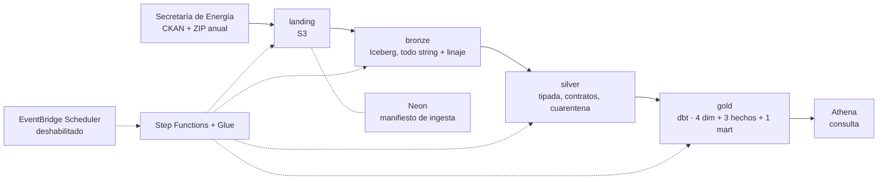

# Argentina Oil Lakehouse (AWS)


Lakehouse serverless sobre los datos públicos del upstream argentino (Secretaría de Energía,
2006-2026). Cubre el camino completo: ingesta idempotente a S3, capas bronze y silver en
Iceberg con contratos de calidad y cuarentena, y un modelo dimensional en dbt sobre Athena,
todo orquestado con Step Functions y desplegado con Terraform en dos ambientes. Corre entero en
AWS y, cuando nadie lo dispara, cuesta cero. Es un proyecto de portfolio: está pensado para que
alguien que evalúa perfiles de ingeniería de datos pueda leer las decisiones, correrlo y
verificar los números.

Deriva de [`ypf-data-platform`](https://github.com/LuisRodriguezzz/ypf-data-platform), donde el
mismo pipeline corría además en una máquina local; acá el único destino es AWS y el porqué —con
lo que se dejó afuera— está en el [ADR 0006](docs/adr/0006-origen-y-alcance.md).

## Arquitectura



Cinco jobs de Glue y una máquina de estados por pipeline. La ingesta es un Python shell de 1/16
de DPU (es I/O de red, no necesita Spark); bronze y silver son Glue 5.0 con Spark e Iceberg;
gold es un job de Glue que corre `dbt build` y deja que el SQL lo ejecute Athena. El catálogo es
el Glue Data Catalog y el manifiesto de ingesta, un Postgres serverless en Neon. Nada queda
prendido entre corridas (ADR 0001).

## Fuentes

| Fuente | Tabla silver | Filas | Cadencia | Ficha |
| --- | --- | ---: | --- | --- |
| Producción de petróleo y gas por pozo (DDJJ) | `silver.produccion_pozo` | 18.218.514 | mensual | [produccion_pozo.md](docs/fuentes/produccion_pozo.md) |
| Padrón de pozos con primera producción | `silver.pozo_primera_produccion` | 86.197 | mensual | [pozo_primera_produccion.md](docs/fuentes/pozo_primera_produccion.md) |
| Datos de fractura (Adjunto IV) | `silver.fractura` | 4.878 | diaria | [fractura.md](docs/fuentes/fractura.md) |
| Reservas y recursos al 31/12 | `silver.reservas` | 198.734 | anual (2020-2024) | [reservas.md](docs/fuentes/reservas.md) |

Las dos primeras salen del mismo dataset de CKAN; reservas es un ZIP suelto por URL fuera del
portal, con un Excel de doble entrada que hay que desarmar.

## Trazabilidad: qué es real y qué es derivado

Cada tabla del lakehouse declara una columna `data_origin`. No hay datos simulados ni
inventados: todo lo que entra viene del portal público, y lo único que no es una medición son
las tablas calculadas sobre ella.

| Tabla | `data_origin` | Qué es |
| --- | --- | --- |
| `bronze/silver.produccion_pozo`, `bronze/silver.pozo_primera_produccion` | `real` | DDJJ y padrón publicados por la Secretaría de Energía |
| `bronze.pozo_catalogo`, `bronze.produccion_pozo_no_convencional` | `real` | Agregados que publica el mismo portal; se cargan pero todavía no tienen contrato |
| `bronze/silver.fractura` | `real` | Declaraciones del Adjunto IV, dato preliminar sujeto a revisión |
| `bronze/silver.reservas` | `real` | Planillas anuales de reservas y recursos por yacimiento |
| `gold.dim_*`, `gold.fact_*`, `gold.mart_*` | `derived` | Modelo dimensional calculado sobre silver |

## Qué demuestra cada módulo

| Módulo | En una línea |
| --- | --- |
| `pipelines/ingest/` | **Idempotencia** en dos niveles (tamaño/fecha de origen y sha256) con manifiesto en Postgres, subiendo con multipart sin buffer en RAM ni archivo temporal, que es lo que permite entrar en 1/16 de DPU |
| `pipelines/spark_jobs/bronze_load.py` | Carga cruda con **linaje** por fila y reemplazo de partición por recurso |
| `pipelines/contracts/` + `silver_load.py` | **Contratos de datos** declarativos: tipos, rangos, checks duros y cuarentena auditable |
| `pipelines/reservas/` | El caso raro: un **Excel de doble entrada** con 7 filas de encabezado y rangos fusionados, parseado por vocabulario y escrito con pyiceberg |
| `pipelines/dbt/` | Modelo dimensional con **SCD tipo 2** sobre 21 años, 73 tests y documentación por columna |
| `pipelines/aws/` | Los **wrappers de Glue**: traducen argumentos del job a variables de entorno y resuelven el secreto por SSM, nunca en claro |
| `infra/terraform/` | **IaC** completa: 29 recursos por ambiente, `terraform destroy` deja costo cero |
| `.github/workflows/ci.yml` | **CI** en dos jobs: lint y tests, y `terraform fmt`/`validate`. No toca AWS |
| `.github/workflows/deploy.yml` | **CD por ambiente**: plan en el PR, apply de dev en `main`, prod con aprobación manual y OIDC (escrito, deshabilitado) |

## Correrlo en AWS

Requisitos: una cuenta de AWS, Terraform, [uv](https://docs.astral.sh/uv/), un proyecto en
[Neon](https://neon.tech) (plan gratuito) y la AWS CLI configurada.

```powershell
cd infra\terraform
terraform init
terraform workspace select -or-create dev     # un workspace por ambiente (ADR 0005)
terraform apply -var-file=envs\dev.tfvars     # 29 recursos: S3, Glue, Step Functions, Athena, IAM
..\..\scripts\aws_deploy.ps1                  # wheel del proyecto + wrappers de los jobs a S3
aws stepfunctions start-execution --state-machine-arn <arn> --input '{}'
```

Falta un paso previo por ambiente: el parámetro SecureString
`/oil-lakehouse/<ambiente>/postgres_dsn` con la cadena de conexión al branch de Neon. El
procedimiento completo —desplegar, correr cada pipeline, consultar en Athena, destruir y
reconstruir de cero— está en el runbook [`infra/terraform/README.md`](infra/terraform/README.md).

**Costos medidos** el 2026-09-06 en el proyecto de origen con este mismo código
([ADR 0006](docs/adr/0006-origen-y-alcance.md)):

- **Reconstruir el entorno entero desde cero** —los cuatro pipelines, incluidas las descargas—
  cuesta **menos de 2 USD** y tarda alrededor de una hora, casi toda esperando a que la ingesta
  baje los CSV.
- El job de gold (`dbt build` sobre Athena) son **0,15 USD por corrida**.
- **En reposo, cero**: no hay NAT Gateway, ni RDS, ni EMR, ni un entorno de orquestación
  administrado, y los schedules de EventBridge nacen deshabilitados.

## Resultados

- **18.218.514 filas** de producción mensual por pozo (2006-2026) cargadas y tipadas. Entre las
  cuatro fuentes quedaron **238 filas en cuarentena** (224 de producción, 12 de fractura, 2 de
  reservas) y ningún recurso falló un check duro.
- **`dim_pozo` con 611.304 tramos** SCD tipo 2 sobre 21 años de declaraciones, con tests de
  unicidad y de no solapamiento de vigencias.
- **El mart llega a 4.635 pozos** con completación y producción cruzadas.
- **El acumulado de petróleo a 12 meses crece 7 veces** entre los pozos no convencionales de
  menos de 20 etapas de fractura y los de más de 40 (cuenca Neuquina).
- **CI en verde**: 129 tests de Python, `ruff check`, `ruff format --check`, `terraform fmt` y
  `terraform validate`; y los 73 tests de dbt que corren dentro del job de gold.

## Qué se verificó y qué no

Lo que sigue son limitaciones reales del proyecto, no pendientes de redacción.

- **En este repo todavía no se aplicó ningún ambiente.** Los números de arriba —filas, tiempos,
  costos— se midieron en el proyecto del que deriva (ADR 0006) con este mismo código, sobre su
  despliegue único sin sufijo de ambiente. Son la referencia contra la que comparar la primera
  corrida, no una medición de este repositorio.
- **dev y prod están definidos en código pero no aplicados.** La variable `environment` sufija
  los 29 recursos, hay un tfvars por ambiente y un workspace de Terraform por state
  ([ADR 0005](docs/adr/0005-ambientes-dev-y-prod.md)). El state sigue siendo local,
  `infra/terraform/bootstrap/` (backend S3, tabla de locks, roles de OIDC) nunca se aplicó y
  `deploy.yml` está deshabilitado a propósito (`if: vars.DEPLOY_ENABLED == 'true'`, variable que
  no existe). Es infraestructura escrita y validada, no infraestructura corriendo.
- **Los jobs de Glue no corren en paralelo.** Los pipelines de fuente comparten `ingest_landing`
  y `silver_load`, y un job de Glue admite una corrida a la vez: hay que dispararlos de a uno.
- **No hay alertas.** Una ejecución fallida queda en el historial de Step Functions y en los
  logs del job; no hay nada que avise. Un webhook en un repo público sería un secreto en el repo.
- **`dbt docs` no se genera.** El catálogo y el manifiesto quedarían en el disco efímero del job
  de Glue, sin nadie que los sirva.
- **No hay streaming ni ML.** El proyecto de origen los tenía y acá se dejaron afuera a
  propósito: un stream factura mientras existe y rompe el costo cero en reposo, y MLflow no
  tiene opción gratuita en AWS ([ADR 0006](docs/adr/0006-origen-y-alcance.md)).
- **El CI no levanta nada en AWS.** Valida lint, tests unitarios y Terraform; que los jobs corran
  de verdad contra Iceberg y Athena se verifica disparando la máquina de estados a mano
  ([ADR 0004](docs/adr/0004-ci-en-github-actions.md)).
- **La ingesta de producción usa la familia "DDJJ abiertas y cerradas"**, comparada un año
  completo (2024) contra la familia normal: es superconjunto estricto (0 filas con valores en
  conflicto en lo que comparten, +159 declaraciones rectificadas que la normal no tiene) y es la
  única que la Secretaría sigue actualizando — la normal quedó congelada 5 meses antes según
  CKAN. Detalle en
  [`docs/fuentes/comparacion-familias-produccion.md`](docs/fuentes/comparacion-familias-produccion.md).

## Documentación

- **Decisiones de arquitectura** — [`docs/adr/`](docs/adr/): lakehouse serverless en Glue, Step
  Functions y Athena (0001), contratos en YAML (0002), gold con dbt sobre Athena (0003), CI
  (0004), ambientes dev y prod (0005), origen y alcance (0006).
- **Fuentes** — [`docs/fuentes/`](docs/fuentes/): una ficha por fuente con lo medido sobre el
  dato real (columnas, clave, rarezas y las decisiones del contrato que salen de ahí), más la
  comparación de las dos familias de producción.
  [`docs/semana-0-derisking.md`](docs/semana-0-derisking.md) tiene las pruebas contra las fuentes
  reales previas a escribir infraestructura.
- **Módulos** — READMEs propios en [`pipelines/ingest/`](pipelines/ingest/README.md),
  [`pipelines/contracts/`](pipelines/contracts/README.md),
  [`pipelines/spark_jobs/`](pipelines/spark_jobs/README.md) e
  [`infra/terraform/`](infra/terraform/README.md), que es además el runbook de despliegue.

## Licencias y atribuciones

- **Datos del upstream argentino**: Secretaría de Energía de la Nación Argentina, portal
  [datos.energia.gob.ar](http://datos.energia.gob.ar). Datos públicos; producción y fractura son
  declaraciones juradas de las operadoras y fractura se publica como dato preliminar sujeto a
  revisión.
- **Este repositorio** no está afiliado a YPF S.A. ni a ninguna de las operadoras que aparecen
  en los datos. El nombre refiere al dominio del problema, no a una compañía.
