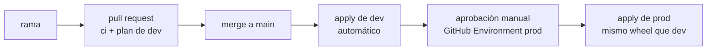

# Argentina Oil Lakehouse (AWS)


Lakehouse serverless sobre los datos públicos del upstream argentino (Secretaría de Energía,
2006-2026): ingesta a S3, bronze y silver en Iceberg con contratos de calidad, y un modelo
dimensional con dbt sobre Athena. Corre entero en AWS y en reposo cuesta cero.

Es un proyecto de portfolio de ingeniería de datos. Deriva de
[`ypf-data-platform`](https://github.com/LuisRodriguezzz/ypf-data-platform), que además corría
sobre una máquina local; acá el único destino es AWS
([ADR 0006](docs/adr/0006-origen-y-alcance.md)).

## Arquitectura


Cinco jobs de Glue y cuatro máquinas de estados. La ingesta es un Python shell de 1/16 de DPU:
es I/O de red y no necesita Spark. Bronze y silver son Glue 5.0 con Spark e Iceberg. Gold es un
job de Glue que corre `dbt build` y deja que el SQL lo ejecute Athena. El catálogo es el Glue
Data Catalog y el manifiesto de ingesta, un Postgres serverless en Neon. Nada queda prendido
entre corridas ([ADR 0001](docs/adr/0001-lakehouse-serverless-en-aws.md)).

## Qué demuestra cada módulo

| Módulo | En una línea |
| --- | --- |
| [`pipelines/ingest/`](pipelines/ingest/README.md) | Idempotencia en dos niveles (tamaño y fecha de origen, después sha256) con manifiesto en Postgres, y subida multipart sin buffer en RAM. |
| `pipelines/spark_jobs/bronze_load.py` | Carga cruda con linaje por fila y reemplazo de la partición del recurso. |
| [`pipelines/contracts/`](pipelines/contracts/README.md) | Contratos de datos en YAML: tipos, rangos, checks duros y cuarentena auditable. |
| `pipelines/reservas/` | Un Excel de doble entrada, con 7 filas de encabezado y rangos fusionados, parseado por vocabulario. |
| `pipelines/dbt/` | Modelo dimensional con SCD tipo 2 sobre 21 años: 9 modelos, 91 tests y documentación por columna. |
| `pipelines/aws/` | Wrappers de Glue: traducen los argumentos del job a variables de entorno y resuelven el secreto por SSM. |
| [`infra/terraform/`](infra/terraform/README.md) | 29 recursos por ambiente, dev y prod con workspaces; `terraform destroy` deja costo cero. |
| [`infra/terraform/bootstrap/`](infra/terraform/bootstrap/README.md) | State remoto en S3 con bloqueo en DynamoDB, y los dos roles de OIDC del despliegue. |
| `.github/workflows/` | CI que no toca AWS (lint, 140 tests, `dbt parse`, Terraform) y CD por ambiente con OIDC. |

## Fuentes

| Fuente | Tabla silver | Filas | Cadencia | Ficha |
| --- | --- | ---: | --- | --- |
| Producción de petróleo y gas por pozo (DDJJ) | `silver.produccion_pozo` | 18.234.202 | mensual | [produccion_pozo.md](docs/fuentes/produccion_pozo.md) |
| Padrón de pozos con primera producción | `silver.pozo_primera_produccion` | 86.197 | mensual | [pozo_primera_produccion.md](docs/fuentes/pozo_primera_produccion.md) |
| Datos de fractura (Adjunto IV) | `silver.fractura` | 4.878 | diaria | [fractura.md](docs/fuentes/fractura.md) |
| Reservas y recursos al 31/12 | `silver.reservas` | 198.734 | anual (2020-2024) | [reservas.md](docs/fuentes/reservas.md) |

Las dos primeras salen del mismo dataset de CKAN. Reservas es un ZIP suelto por URL, fuera del
portal, con un Excel de doble entrada que hay que desarmar. No hay datos simulados: cada tabla
declara una columna `data_origin`, `real` en lo que entra del portal y `derived` en gold.

## Cómo se opera hoy

El despliegue es automático desde el 2026-09-12. Los pipelines se disparan a mano.



- El state de Terraform vive en S3 con bloqueo en DynamoDB, un archivo por workspace.
- GitHub Actions se autentica con OIDC. No hay claves de AWS en los secretos del repo.
- Cada `apply` sube el wheel del proyecto y los wrappers de los jobs a `artifacts/` del bucket.
  Prod no vuelve a construir el wheel: baja el artefacto que ya corrió en dev.
- El porqué está en el [ADR 0005](docs/adr/0005-ambientes-dev-y-prod.md).

Disparar un pipeline es un comando. Los cuatro son `produccion_pozo_mensual`,
`fractura_diaria`, `reservas_mensual` y `gold_mensual`.

```powershell
cd infra\terraform
terraform workspace select prod
$arn = (terraform output -json state_machine_arns | ConvertFrom-Json).fractura_diaria
aws stepfunctions start-execution --state-machine-arn $arn --input '{}'
..\..\scripts\aws_logs.ps1 -Ambiente prod    # resumen de la última corrida de cada job
```

## Resultados medidos

Medido en `prod`: la carga completa de los 21 años el 2026-09-12; gold, sus tests y los
hallazgos, el 2026-09-16, después de recalcular la primera producción de cada pozo desde las
declaraciones ([ficha del padrón](docs/fuentes/pozo_primera_produccion.md)).

| Qué | Valor |
| --- | ---: |
| Filas de producción mensual por pozo (2006-2026) | 18.234.202 |
| Filas en cuarentena entre las cuatro fuentes (225 producción, 12 fractura, 2 reservas) | 239 |
| Recursos que fallaron un check duro | 0 |
| Tramos de vigencia en `dim_pozo` (SCD tipo 2) | 611.677 |
| Pozos en el mart, con completación y producción cruzadas | 4.635 |
| Tests de dbt en verde, dentro del job de gold | 91 |
| Tests de Python en verde, en el CI | 140 |
| Costo de la reconstrucción completa | < 2 USD |

| Paso | Job | Duración |
| --- | --- | --- |
| Ingesta de producción (24 archivos, 5,96 GB) | Python shell, 1/16 DPU | 49 min |
| Bronze de producción | Spark, 4 workers | 7 min |
| Silver de producción + padrón | Spark, 4 workers | 19 + 2 min |
| Fractura y reservas, máquinas completas | | 6 y 5 min |
| Gold (9 modelos, 91 tests sobre Athena) | Glue 5.0, 2 workers | 7 min |

Casi todo el tiempo es la descarga del portal. Gold cuesta unos 0,15 USD por corrida.

Tres hallazgos sobre el dato, no sobre la infraestructura:

- En los pozos no convencionales de la cuenca Neuquina, la mediana del petróleo acumulado en
  los primeros 12 meses es 13 veces mayor con más de 40 etapas de fractura (32.800 m3, 1.267
  pozos) que con menos de 20 (2.500 m3, 1.335 pozos). Con la media da 7 veces: entre los pozos
  de pocas etapas hay unos pocos muy buenos que la levantan.
- La curva tipo de Vaca Muerta shale (`mart_curva_tipo`, pozos petrolíferos, mediana del
  acumulado por cohorte de primera producción) cuenta la historia del play: 3.500 m3 a los 12
  meses en las cohortes 2013-2015, 17.000 en 2016, 33.000 en 2019, y desde 2021 una meseta en
  37.000-39.000 m3 durante cinco cohortes seguidas. El diseño de completación maduró y la mejora
  por pozo se frenó.
- La ingesta usa la familia "DDJJ abiertas y cerradas" y no la normal. Comparado un año
  completo: 0 diferencias en producción, inyección y estado, +159 declaraciones rectificadas, y
  es la única que la Secretaría sigue actualizando
  ([comparación](docs/fuentes/comparacion-familias-produccion.md)).

## Qué no hace

Son límites del proyecto, no pendientes de redacción.

- **No hay streaming ni ML.** El proyecto de origen los tenía. Un stream factura mientras
  existe y MLflow no tiene opción gratuita en AWS
  ([ADR 0006](docs/adr/0006-origen-y-alcance.md)).
- **No hay monitoreo ni alertas.** Una ejecución fallida queda en el historial de Step Functions
  y en los logs del job. Nada avisa.
- **Los pipelines no corren solos.** Los schedules de EventBridge existen pero nacen
  deshabilitados en los dos ambientes. El despliegue automático tampoco los dispara.
- **`main` no tiene protección de rama.** El repo lo toca una sola persona. El CI corre en cada
  pull request, pero nada impide un push directo.
- **Los jobs de Glue no corren en paralelo.** Admiten una corrida a la vez y se comparten entre
  pipelines; el que llega segundo espera y reintenta
  ([ADR 0001](docs/adr/0001-lakehouse-serverless-en-aws.md)).
- **El CI no levanta nada en AWS.** Que los jobs corran contra Iceberg y Athena se verifica
  disparando la máquina de estados ([ADR 0004](docs/adr/0004-ci-en-github-actions.md)).
- **`dbt docs` no se genera** ([ADR 0003](docs/adr/0003-gold-con-dbt-sobre-athena.md)).
- **dev no reproduce el dataset.** Con 2 workers la carga completa de producción no entra en el
  timeout de 60 minutos del job, así que dev corre con producción acotada a 2024.

## Documentación

- **Decisiones** — [`docs/adr/`](docs/adr/): lakehouse serverless (0001), contratos en YAML
  (0002), gold con dbt sobre Athena (0003), CI (0004), ambientes dev y prod (0005), origen y
  alcance (0006).
- **Fuentes** — [`docs/fuentes/`](docs/fuentes/): una ficha por fuente con lo medido sobre el
  dato real. [`docs/semana-0-derisking.md`](docs/semana-0-derisking.md) tiene las pruebas
  contra las fuentes reales previas a escribir infraestructura.
- **Runbook** — [`infra/terraform/README.md`](infra/terraform/README.md): desplegar, correr un
  pipeline, consultar, destruir y reconstruir de cero.

## Licencias y atribuciones

- **Datos del upstream argentino**: Secretaría de Energía de la Nación Argentina, portal
  [datos.energia.gob.ar](http://datos.energia.gob.ar). Datos públicos. Producción y fractura son
  declaraciones juradas de las operadoras, y fractura se publica como dato preliminar sujeto a
  revisión.
- **Este repositorio** no está afiliado a YPF S.A. ni a ninguna de las operadoras que aparecen
  en los datos. El nombre refiere al dominio del problema, no a una compañía.
