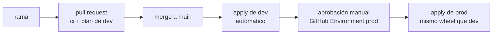

# Argentina Oil Lakehouse (AWS)


Lakehouse serverless sobre los datos públicos del upstream argentino (Secretaría de Energía,
2006-2026): ingesta a S3, bronze y silver en Iceberg con contratos de calidad, y un modelo
dimensional con dbt sobre Athena. Corre entero en AWS y en reposo cuesta cero.

**Stack:** Python 3.11 · PySpark en Glue 5.0 · Apache Iceberg · Athena · dbt · Step Functions ·
Terraform · GitHub Actions · Postgres serverless en Neon.

Es un proyecto de portfolio de ingeniería de datos: el camino completo desde la fuente pública
hasta el informe, desplegado como un producto —dos ambientes, state remoto, despliegue
automático sin claves de AWS guardadas y con aprobación manual para prod— y con cada decisión
escrita en un [ADR](docs/adr/). El alcance es solo AWS, a propósito
([ADR 0006](docs/adr/0006-alcance-solo-aws.md)).

**Lo que dicen los datos, en una página:
[Vaca Muerta, generación por generación](https://luisrodriguezzz.github.io/argentina-oil-lakehouse-aws/hallazgos.html).**
Cuánto produce un pozo típico de Vaca Muerta en sus primeros meses según el año en que arrancó
(la curva tipo por cohorte), cuánto pesa el diseño de la fractura y cómo se comparan las
operadoras. Se genera desde la capa gold.

**Por dónde empezar.** Con cinco minutos: el informe y [Resultados medidos](#resultados-medidos).
Con media hora: [ADR 0001](docs/adr/0001-lakehouse-serverless-en-aws.md) (por qué estas piezas),
[`pipelines/contracts/`](pipelines/contracts/README.md) (cómo se valida el dato),
[`pipelines/spark_jobs/`](pipelines/spark_jobs/README.md) (bronze y silver) y
[ADR 0003](docs/adr/0003-gold-con-dbt-sobre-athena.md) (gold). Para operarlo: el
[runbook](infra/terraform/README.md). Los términos del dominio están en el [glosario](#glosario).

## Arquitectura


Cinco jobs de Glue y cuatro máquinas de estados. La ingesta es un Python shell de 1/16 de DPU
(la unidad de cómputo que cobra Glue; 1/16 es la más chica): es I/O de red y no necesita Spark.
Bronze y silver son Glue 5.0 con Spark e Iceberg. Gold es un job de Glue que corre `dbt build` y
deja que el SQL lo ejecute Athena. El catálogo es el Glue Data Catalog. El manifiesto de ingesta
—qué archivo se bajó, cuándo, con qué tamaño y sha256, y si salió bien— vive en un Postgres
serverless en Neon. Nada queda prendido entre corridas
([ADR 0001](docs/adr/0001-lakehouse-serverless-en-aws.md)).

## Qué demuestra cada módulo

| Módulo | En una línea |
| --- | --- |
| [`pipelines/ingest/`](pipelines/ingest/README.md) | Idempotencia en dos niveles (tamaño y fecha de origen, después sha256) con manifiesto en Postgres, y subida multipart sin buffer en RAM. |
| [`pipelines/spark_jobs/`](pipelines/spark_jobs/README.md) | Bronze: carga cruda, todo texto, con linaje por fila y reemplazo de la partición del recurso. Silver: aplica el contrato, castea y manda a cuarentena lo que no cumple. |
| [`pipelines/contracts/`](pipelines/contracts/README.md) | Contratos de datos en YAML: tipos, rangos, checks duros y cuarentena auditable. |
| [`pipelines/reservas/`](pipelines/reservas/) | Un Excel de doble entrada, con 7 filas de encabezado y rangos fusionados: los encabezados se reconocen por su texto, no por su posición. |
| [`pipelines/dbt/`](pipelines/dbt/README.md) | Modelo dimensional sobre 21 años: dimensión de pozos con historial (SCD tipo 2), 9 modelos, 94 tests y documentación por columna. |
| [`pipelines/aws/`](pipelines/aws/) | Wrappers de Glue: traducen los argumentos del job a variables de entorno y resuelven el secreto por SSM. |
| [`infra/terraform/`](infra/terraform/README.md) | 29 recursos por ambiente, dev y prod con workspaces; `terraform destroy` deja costo cero. |
| [`infra/terraform/bootstrap/`](infra/terraform/bootstrap/README.md) | State remoto en S3 con bloqueo en DynamoDB, y los dos roles de OIDC del despliegue. |
| [`scripts/`](scripts/) | Despliegue del wheel (`aws_deploy`), resumen de la última corrida de cada job (`aws_logs`), inspección de tablas y cuarentena (`check_lake.py`) y el informe de hallazgos (`informe_gold.py`). |
| [`.github/workflows/`](.github/workflows/) | CI que no toca AWS (lint, 140 tests, `dbt parse`, Terraform) y CD por ambiente con OIDC. |

## Fuentes

| Fuente | Tabla silver | Filas | Cadencia | Ficha |
| --- | --- | ---: | --- | --- |
| Producción de petróleo y gas por pozo (DDJJ: declaraciones juradas mensuales de las operadoras) | `silver.produccion_pozo` | 18.234.202 | mensual | [produccion_pozo.md](docs/fuentes/produccion_pozo.md) |
| Padrón de pozos con primera producción | `silver.pozo_primera_produccion` | 86.197 | mensual | [pozo_primera_produccion.md](docs/fuentes/pozo_primera_produccion.md) |
| Datos de fractura (Adjunto IV: el formulario con que se declara cada operación de fractura) | `silver.fractura` | 4.878 | diaria | [fractura.md](docs/fuentes/fractura.md) |
| Reservas y recursos al 31/12 | `silver.reservas` | 198.734 | anual (2020-2024) | [reservas.md](docs/fuentes/reservas.md) |

Las dos primeras salen del mismo dataset del portal (CKAN, la plataforma de datos abiertos de
la Secretaría; cada archivo de un dataset es un *recurso*). Reservas es un ZIP suelto por URL,
fuera del portal, con un Excel de doble entrada que hay que desarmar. El portal publica cada
año de producción en dos familias de CSV; se usa "DDJJ abiertas y cerradas", la única que sigue
actualizándose ([comparación](docs/fuentes/comparacion-familias-produccion.md)). No hay datos
simulados: cada tabla declara una columna `data_origin`, `real` en lo que entra del portal y
`derived` en gold.

## Cómo se opera

El despliegue es automático; los pipelines se disparan a mano.



- El state de Terraform vive en S3 con bloqueo en DynamoDB, un archivo por workspace.
- GitHub Actions se autentica con OIDC: presenta un token firmado por GitHub y AWS le entrega
  credenciales temporales de un rol. No hay claves de AWS en los secretos del repo.
- Cada `apply` sube el wheel del proyecto y los wrappers de los jobs a `artifacts/` del bucket.
  Prod no vuelve a construir el wheel: baja el artefacto que ya corrió en dev.
- El porqué está en el [ADR 0005](docs/adr/0005-ambientes-dev-y-prod.md).

Disparar un pipeline es un comando sobre su máquina de estados (`produccion_pozo_mensual`,
`fractura_diaria`, `reservas_mensual` o `gold_mensual`):

```powershell
aws stepfunctions start-execution --state-machine-arn <arn> --input '{}'
..\..\scripts\aws_logs.ps1 -Ambiente prod    # resumen de la última corrida de cada job
```

Cómo obtener el ARN, acotar una corrida, consultar en Athena, destruir y reconstruir de cero:
[runbook](infra/terraform/README.md#correr-un-pipeline).

## Resultados medidos

Medido en `prod` en septiembre de 2026: la carga completa de los 21 años, gold y sus tests.

| Qué | Valor |
| --- | ---: |
| Filas de producción mensual por pozo (2006-2026) | 18.234.202 |
| Filas en cuarentena entre las cuatro fuentes (225 producción, 12 fractura, 2 reservas) | 239 |
| Archivos de origen rechazados por esquema o clave rotos (check duro) | 0 |
| Tramos de vigencia en `dim_pozo` (SCD tipo 2) | 611.677 |
| Pozos con fractura y producción cruzadas en el mart (4.247 fracturados antes de su primer mes de producción) | 4.635 |
| Tests de dbt en verde, dentro del job de gold | 94 |
| Tests de Python en verde, en el CI | 140 |
| Costo de la reconstrucción completa | < 2 USD |

| Paso | Job | Duración |
| --- | --- | --- |
| Ingesta de producción (24 archivos, 5,96 GB) | Python shell, 1/16 DPU | 49 min |
| Bronze de producción | Spark, 4 workers | 7 min |
| Silver de producción + padrón | Spark, 4 workers | 19 + 2 min |
| Fractura y reservas, máquinas completas | | 6 y 5 min |
| Gold (9 modelos, 94 tests sobre Athena) | Glue 5.0, 2 workers | 7 min |

Casi todo el tiempo es la descarga del portal. Gold cuesta unos 0,15 USD por corrida.

### Tres hallazgos sobre el dato

La curva tipo de una cohorte es la producción acumulada del pozo mediano de esa cohorte, mes a
mes desde su primera producción; la cohorte es el año en que el pozo produjo por primera vez.

- **La curva tipo de Vaca Muerta shale** (`mart_curva_tipo`, pozos petrolíferos) cuenta la
  historia de la formación: 3.500 m3 de petróleo a los 12 meses en las cohortes 2013-2015,
  17.000 en 2016, 33.000 en 2019, y desde 2021 una meseta en 37.000-39.000 m3 durante cinco
  cohortes seguidas. El diseño de completación maduró y la mejora por pozo se frenó.
- **Más etapas, más petróleo, con matices.** En los pozos no convencionales de la cuenca
  Neuquina, la mediana del petróleo acumulado en los primeros 12 meses es 12 veces mayor con
  más de 40 etapas de fractura (32.700 m3, 1.266 pozos) que con menos de 20 (2.700 m3, 1.314
  pozos). Con la media da 7 veces: entre los pozos de pocas etapas hay unos pocos muy buenos
  que la levantan.
- **La familia de datos importa.** La ingesta usa "DDJJ abiertas y cerradas" y no la normal.
  Comparado un año completo: 0 diferencias en producción, inyección y estado, +159
  declaraciones rectificadas, y es la única que la Secretaría sigue actualizando
  ([comparación](docs/fuentes/comparacion-familias-produccion.md)).

Los gráficos de los dos primeros están en
[el informe publicado](https://luisrodriguezzz.github.io/argentina-oil-lakehouse-aws/hallazgos.html):
curva tipo por cohorte, distribución y diseño por cohorte, mapa de rama contra arena y las
operadoras contra el conjunto. El HTML es `docs/hallazgos.html`; lo produce
`scripts/informe_gold.py` con cuatro consultas a gold (`uv run python scripts/informe_gold.py`).

## Qué no hace

Son límites del proyecto, no pendientes de redacción.

- **No hay streaming ni ML.** Un stream factura mientras existe y MLflow no tiene opción
  gratuita en AWS; los dos romperían el costo cero en reposo
  ([ADR 0006](docs/adr/0006-alcance-solo-aws.md)).
- **No hay monitoreo ni alertas.** Una ejecución fallida queda en el historial de Step Functions
  y en los logs del job. Nada avisa.
- **Los pipelines no corren solos.** Los schedules de EventBridge existen pero nacen
  deshabilitados en los dos ambientes. El despliegue automático tampoco los dispara.
- **`main` no tiene protección de rama.** El repo lo toca una sola persona. El CI corre en cada
  pull request, pero nada impide un push directo.
- **Los jobs de Glue no corren en paralelo.** Admiten una corrida a la vez y se comparten entre
  pipelines; el que llega segundo espera y reintenta
  ([ADR 0001](docs/adr/0001-lakehouse-serverless-en-aws.md)).
- **El CI no levanta nada en AWS.** Que los jobs corran contra Iceberg y Athena se verifica
  disparando la máquina de estados ([ADR 0004](docs/adr/0004-ci-en-github-actions.md)).
- **`dbt docs` no se genera** ([ADR 0003](docs/adr/0003-gold-con-dbt-sobre-athena.md)).
- **dev no reproduce el dataset.** Con 2 workers la carga completa de producción no entra en el
  timeout de 60 minutos del job, así que dev corre con producción acotada a 2024.

## Desarrollo local

Hace falta Python 3.11 o 3.12 y [uv](https://docs.astral.sh/uv/). Lo mismo que corre el CI:

```powershell
uv sync --all-groups
uv run ruff check . ; uv run ruff format --check .
uv run pytest
uvx --from "dbt-core==1.11.14" --with "dbt-athena==1.11.0" dbt parse --profiles-dir pipelines/dbt --project-dir pipelines/dbt
```

`dbt parse` necesita seis variables de entorno con cualquier valor (las mismas que
`.github/workflows/ci.yml`); no se conecta a Athena. Los jobs de Spark no corren fuera de AWS:
el catálogo es el Glue Data Catalog.

## Documentación

- **Decisiones** — [`docs/adr/`](docs/adr/): lakehouse serverless (0001), contratos en YAML
  (0002), gold con dbt sobre Athena (0003), CI (0004), ambientes dev y prod (0005), alcance y
  qué queda afuera (0006).
- **Fuentes** — [`docs/fuentes/`](docs/fuentes/): una ficha por fuente con lo medido sobre el
  dato real, y la [comparación de las dos familias de
  producción](docs/fuentes/comparacion-familias-produccion.md).
  [`docs/semana-0-derisking.md`](docs/semana-0-derisking.md) es la bitácora de las pruebas
  contra las fuentes reales previas a escribir infraestructura; las fichas la reemplazan.
- **Runbook** — [`infra/terraform/README.md`](infra/terraform/README.md): desplegar, correr un
  pipeline, consultar, destruir y reconstruir de cero.

## Glosario

- **DDJJ**: declaraciones juradas. Cada operadora declara todos los meses la producción de cada
  pozo; es la fuente de producción.
- **Capítulo IV / Adjunto IV**: los formularios del régimen de declaración con que el portal
  rotula el padrón de pozos y los partes de fractura.
- **Recurso**: cada archivo de un dataset del portal (un CSV por año, por ejemplo). La ingesta
  y bronze trabajan recurso por recurso.
- **`idpozo`**: el identificador numérico que cruza producción, padrón y fractura. Identifica
  pozo × formación productiva: una misma sigla (la boca de pozo) puede tener varios `idpozo`.
- **Manifiesto de ingesta**: la tabla de Postgres que registra cada descarga (tamaño, fecha,
  sha256, resultado) y evita bajar dos veces lo mismo.
- **Cuarentena**: la tabla `<tabla>_rejects` de silver donde va cada fila que viola un rango o
  un dominio del contrato, con su motivo. **Check duro**: una violación que frena el job entero
  (columna faltante, nulo prohibido, clave duplicada).
- **SCD tipo 2**: dimensión con historial. `dim_pozo` tiene una fila por cada tramo de meses en
  que los atributos del pozo no cambiaron, y cada hecho se cuelga del tramo vigente en su mes.
- **Cohorte / curva tipo**: ver [Tres hallazgos](#tres-hallazgos-sobre-el-dato).
- **DPU**: la unidad de cómputo que cobra Glue. **G.1X**: el worker estándar de Spark en Glue
  (4 vCPU, 16 GB).
- **Workgroup de Athena**: agrupa consultas con su ubicación de resultados y sus límites; uno
  por ambiente.
- **OIDC**: el mecanismo con que GitHub Actions obtiene credenciales temporales de AWS sin
  claves guardadas.

## Datos y atribuciones

- **Datos del upstream argentino**: Secretaría de Energía de la Nación Argentina, portal
  [datos.energia.gob.ar](http://datos.energia.gob.ar). Datos públicos. Producción y fractura son
  declaraciones juradas de las operadoras, y fractura se publica como dato preliminar sujeto a
  revisión.
- **Este repositorio** no está afiliado a YPF S.A. ni a ninguna de las operadoras que aparecen
  en los datos. El nombre del repo habla del dominio, el upstream argentino, no de una compañía.
